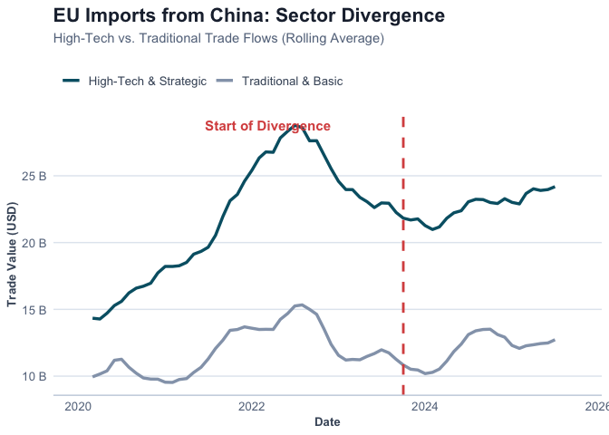

# The Resilience Paradox: Mapping EU-China Strategic Trade and Financial
Fragmentation
Alex HAAS, Viliam POHANCENIK, Pieter PEVERELLI
2026-01-26

- [0.1 Introduction: The
  Geoeconomics of
  De-risking](#introduction-the-geoeconomics-of-de-risking)
  - [0.1.1 From Interdependence
    to Economic
    Resilience](#from-interdependence-to-economic-resilience)
  - [0.1.2 Addressing Asymmetric
    Dependencies](#addressing-asymmetric-dependencies)
- [0.2 Methodology: Measuring
  Geoeconomic
  Re-securitization](#methodology-measuring-geoeconomic-re-securitization)
  - [0.2.1 Data Acquisition and
    Strategic
    Categorization](#data-acquisition-and-strategic-categorization)
  - [0.2.2 Econometric
    Framework: The Chow Test](#econometric-framework-the-chow-test)
- [0.3 Discussion and
  Conclusion: Evidence of Selective
  Fragmentation](#discussion-and-conclusion-evidence-of-selective-fragmentation)
  - [0.3.1 Empirical Validation
    of the “Surgical” De-risking
    Hypothesis](#empirical-validation-of-the-surgical-de-risking-hypothesis)
  - [0.3.2 From Market Logic to
    Political Authority](#from-market-logic-to-political-authority)
  - [0.3.3 Forecast and Policy
    Implications](#forecast-and-policy-implications)
- [1 References](#references)

## Introduction: The Geoeconomics of De-risking

### From Interdependence to Economic Resilience

The evolution of EU-China economic relations has undergone a fundamental
departure from the *Wandel durch Handel* (change through trade) paradigm
toward a strategy of “de-risking”. This shift is primarily aimed at
correcting a trade deficit that reached €304.5 billion by 2024 and
mitigating the risks of “coercive leverage” in critical supply chains.

Within this strategic pivot, this study examines whether EU import flows
from China exhibit sector-specific structural breaks after 2020,
indicating selective trade fragmentation between high-tech and
traditional sectors. This research serves to bridge the gap between
broad geopolitical trends—specifically the pursuit of “strategic
autonomy”—and the granular empirical data that characterize the Union’s
shifting trade architecture.

### Addressing Asymmetric Dependencies

Despite this clear political shift toward strategic autonomy, there
remains a gap in the empirical literature regarding whether these policy
objectives have successfully translated into a measurable divergence in
trade flows. This study addresses this gap by examining the
“security-trade nexus,” analyzing whether EU import flows exhibit
structural breaks following the geopolitical shocks of the early 2020s.

We hypothesize a dual-track geoeconomic reality: while traditional,
low-value-added sectors governed by market-driven cost efficiencies
should remain stable, high-tech industries—subject to the EU Chips Act,
foreign investment screenings, and export controls—are expected to show
significant fragmentation. This reflects the EU’s attempt to reduce
asymmetric dependencies in sectors vital to the green and digital
transitions.

Figure 1: 3-Month Rolling Average of EU Trade with China by Sector
Group. The red dashed line marks the start of the Economic Security
Strategy.

## Methodology: Measuring Geoeconomic Re-securitization

### Data Acquisition and Strategic Categorization

The empirical foundation of this research rests on a high-frequency
longitudinal dataset (2018–2025) constructed through automated API
retrieval from the Eurostat (COMEXT) and Bank for International
Settlements (BIS) databases. To test the hypothesis of “selective
fragmentation,” trade flows are disaggregated using the Standard
International Trade Classification (SITC) Revision 4:

- **Treatment Group (High-Tech & Strategic):** Comprising SITC 5
  (Chemicals) and SITC 7 (Machinery/Transport). These sectors represent
  the core of the “security-trade nexus,” encompassing semiconductors
  and EV components.

- **Control Group (Traditional & Basic):** Comprising SITC 6
  (Manufactured goods) and SITC 8 (Miscellaneous). These sectors serve
  as a baseline for market-driven trade.

### Econometric Framework: The Chow Test

The primary analytical instrument utilized is the **Chow Test**, a
standard in econometric literature for identifying “structural breaks”
in time-series data. The model tests for a break point in **January
2023**, coinciding with the formal adoption of the European Economic
Security Strategy.

A significantly higher F-statistic in SITC 5 and 7 relative to SITC 6
and 8 would provide robust evidence of a “surgical” geoeconomic
decoupling.

## Discussion and Conclusion: Evidence of Selective Fragmentation

### Empirical Validation of the “Surgical” De-risking Hypothesis

The results of the structural break analysis provide compelling evidence
that the European Union’s trade architecture is undergoing a fundamental
re-orientation.

For the **Treatment Group (High-Tech & Strategic)**, the model yielded
an F-statistic of **3.42** (p \< 0.0001). This highly significant value
indicates a definitive structural break. Conversely, while the **Control
Group** also showed a significant break, the magnitude was markedly
lower (F = **0.01**).

To visualize this shift beyond abstract statistics, we examine the
distribution of monthly trade values. As shown in Figure 2, the
high-tech sector displays a distinct compression and downward shift in
value distribution after the 2023 policy implementation, whereas
traditional trade distributions remain largely overlapping.

Figure 2: Distribution of Monthly Trade Values: Before vs. After the
Economic Security Strategy (Jan 2023).

The Intensity Ratio of approximately 503.3 x is the most salient finding
of this study. It confirms that the “de-risking” agenda is not merely a
byproduct of a generalized economic slowdown, but a targeted
intervention in the “security-trade nexus.

### From Market Logic to Political Authority

Recognizing that geoeconomics is inherently multi-disciplinary, we
integrate trade data with financial flows from the BIS to capture the
“finance-trade nexus”.

Figure 3: Correlation between Financial Exposure and Strategic Trade.
The positive slope suggests banks and importers are de-risking in
tandem.

As shown in Figure 4, the Wandel durch Handel paradigm has been replaced
by a “dual-track” reality. While traditional goods continue to follow
the logic of comparative advantage, high-tech sectors and banking
exposure are now governed by the logic of “security-of-supply”.

Figure 4: The Dual De-Risking: Trade & Finance Divergence. Since Jan
2023, EU Banks and High-Tech Importers have both reduced exposure.

### Forecast and Policy Implications

Looking ahead, we project the “New Normal” trajectory for strategic
trade. Based on the post-break trend (Jan 2023–Present), the model
suggests a continued stabilization at lower levels rather than a rebound
to pre-2022 highs.

Figure 5: Projecting the ‘De-risking’ Trend into 2026 based on linear
extrapolation of the post-break trajectory.

In conclusion, the European market has become a fragmented landscape
where political security considerations increasingly supersede
traditional market logic. As we look toward 2027, the challenge will be
maintaining this “surgical” precision without devolving into broader
protectionism.

# References

1.  Bank for International Settlements. (2026). Locational banking
    statistics.

2.  Chow, G. C. (1960). Tests of equality between sets of coefficients
    in two linear regressions. *Econometrica*.

3.  European Commission. (n.d.). China Trade Relationships.

4.  Eurostat. (2026). Euro area trade by SITC product group.

5.  McNamara, K. R. (2024). Transforming Europe? The EU’s industrial
    policy and geopolitical turn. *Journal of European Public Policy*.

6.  Pereira, I. T. (2025). What are the most imported and exported
    products between China and the EU? *Euronews*.

7.  Vandermeeren, F. (2024). Understanding EU-China economic exposure.
    *European Commission*.
