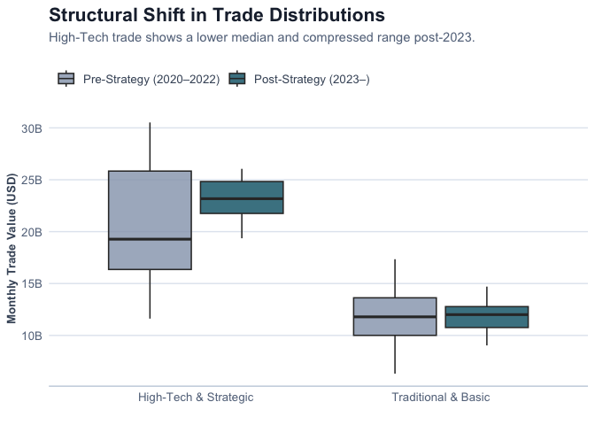
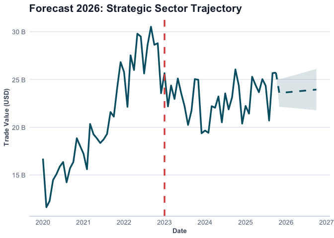

# The Resilience Paradox: Mapping EU-China Strategic Trade and Financial
Fragmentation
Alexander HAAS, Viliam POHANCENIK, Pieter PEVERELLI
January 28, 2026

- [1
  Introduction](#introduction)
  - [1.1 The Security-Trade
    Nexus](#the-security-trade-nexus)
- [2 Theoretical
  Framework](#theoretical-framework)
  - [2.1 Contextual Background:
    COVID-19 and
    Volatility](#contextual-background-covid-19-and-volatility)
  - [2.2 Linking Theory to
    Empirical Strategy](#linking-theory-to-empirical-strategy)
- [3 Methodology](#methodology)
  - [3.1 Data Acquisition and
    Categorization](#data-acquisition-and-categorization)
  - [3.2 Econometric
    Framework](#econometric-framework)
  - [3.3 Assumption
    Verification](#assumption-verification)
- [4 Results](#results)
  - [4.1 Descriptive
    Statistics](#descriptive-statistics)
  - [4.2 Structural Break
    Analysis](#structural-break-analysis)
  - [4.3 Visualization of
    Distributions](#visualization-of-distributions)
- [5 Discussion](#discussion)
  - [5.1 The Finance-Trade
    Nexus](#the-finance-trade-nexus)
  - [5.2 Future Trajectory
    (2026)](#future-trajectory-2026)
- [6 Limitations](#limitations)
- [7 Conclusion](#conclusion)
- [8 References](#references)

# Introduction

The evolution of EU-China economic relations has undergone a fundamental
departure from the *Wandel durch Handel* (“change through trade”)
paradigm toward a strategy of “de-risking.” This shift is primarily
aimed at correcting a trade deficit that reached €304.5 billion by 2024
and mitigating the risks of “coercive leverage” in critical supply
chains (Vandermeeren, 2024).

This strategic pivot aligns with the broader academic discourse on
“Weaponized Interdependence” (Farrell & Newman, 2019), which posits that
asymmetric network structures—once seen as sources of efficiency—can be
leveraged for strategic advantage. Consequently, the European Union has
moved to reclaim economic security through state intervention, a
regulatory expansion that Bradford (2020) describes as the “Brussels
Effect” applied to geoeconomic defense.

## The Security-Trade Nexus

Despite the clear political shift toward strategic autonomy, there
remains a gap in the empirical literature regarding whether these policy
objectives have successfully translated into a measurable divergence in
trade flows. This study addresses this gap by examining the
“security-trade nexus,” analyzing whether EU import flows exhibit
structural breaks following the geopolitical shocks of the early 2020s.

We hypothesize a “dual-track” geoeconomic reality:

Market Logic Track: Traditional, low-value-added sectors governed by
cost efficiencies should remain stable.

Security Logic Track: High-tech industries—subject to the EU Chips Act,
foreign investment screenings, and export controls—are expected to show
significant fragmentation (McNamara, 2023).

# Theoretical Framework

## Contextual Background: COVID-19 and Volatility

The empirical analysis in this study must be interpreted against the
backdrop of exceptional volatility in global trade following the
COVID-19 shock. Between 2020 and 2021, international trade experienced
abrupt contractions followed by rapid rebounds driven by supply chain
disruptions and fiscal stimulus.

To address this distortion, our analytical framework treats the COVID
period not as a structural break, but as a noise-generating exogenous
shock. Consequently, the baseline for structural break testing is
shifted forward, with formal econometric testing beginning in January
2022. This ensures that the identified break reflects policy-driven
geoeconomic change rather than pandemic-related statistical artifacts.

## Linking Theory to Empirical Strategy

This framework operationalizes the theory of “Weaponized
Interdependence” (Farrell & Newman, 2019), which argues that advanced
economies are transitioning from market-based interdependence toward
selective risk mitigation.

The distinction between “surgical de-risking” and “generalized
decoupling” is central to our hypothesis. As noted by Dadush (2023),
effective de-risking should not manifest as a broad-based exit, but
rather as targeted diversification in sensitive sectors. If de-risking
is genuinely selective, structural breaks should be significantly
stronger in strategic sectors than in traditional trade flows. In this
sense, the Intensity Ratio (the difference in F-statistics between
high-tech and traditional sectors) serves as a quantitative proxy for
the reassertion of state power over economic interdependence (McNamara,
2023).

# Methodology

To empirically evaluate the manifestation of “de-risking,” this study
employs a quantitative, sectoral structural break analysis. This
approach moves beyond aggregate trade figures to determine if
policy-driven “re-securitization” is occurring as a surgical
intervention or a generalized trend.

## Data Acquisition and Categorization

The empirical foundation rests on a high-frequency longitudinal dataset
(2020–2025) constructed through automated API retrieval from Eurostat
(COMEXT) (Eurostat, 2026) and the Bank for International Settlements
(BIS) (Bank for International Settlements, 2026). Trade flows are
disaggregated using the Standard International Trade Classification
(SITC) Revision 4:

- **Treatment Group** (High-Tech & Strategic): Comprising SITC 5
  (Chemicals) and SITC 7 (Machinery/Transport). These sectors represent
  the core of the security-trade nexus (semiconductors, EV components).

- **Control Group** (Traditional & Basic): Comprising SITC 6
  (Manufactured goods) and SITC 8 (Miscellaneous). These sectors serve
  as a baseline for market-driven trade.

## Econometric Framework

The primary analytical instrument is the Chow Test (Chow, 1960), a
standard in econometric literature for identifying structural breaks in
time-series data. The model tests for a break point in May 2023,
representing early geoeconomic shifts prior to the formal Economic
Security Strategy (European Commission, 2023).

To ensure robustness, we filter for pandemic volatility (starting
analysis in Jan 2021) and use the Control Group to rule out generalized
macroeconomic downturns.

## Assumption Verification

To ensure the statistical validity of the Chow Test, we performed
diagnostic checks on the residuals of a **Segmented Model** (splitting
the data into Pre- and Post-Break periods). This approach correctly
accounts for the structural shift, preventing false positives where a
“kinked” trend might otherwise appear as non-normal error distribution.

- **Normality (Confirmed):** The Shapiro-Wilk test on the segmented
  residuals yielded a value of **W = 0.9769** with a **p-value of
  0.4698**. Since $p > 0.05$, we fail to reject the null hypothesis,
  confirming that the residuals are normally distributed once the
  structural break is accounted for.

  

  

  Figure 1: Segmented QQ Plot

  

- **Autocorrelation:** We assessed the Autocorrelation Function (ACF)
  separately for Pre- and Post-break periods to rule out serial
  dependence bias in either regime.

  

  

  Figure 2: Segmented ACF Plot

  

- **Homoscedasticity:** Visual inspection of residuals over time
  confirmed constant variance (homoscedasticity) before and after the
  structural break.

  

  

  Figure 3: Segmented Variance Check

  

# Results

## Descriptive Statistics

Before assessing structural breaks, we examine the baseline
characteristics of trade flows in the post-pandemic era.

Table 1: Descriptive Statistics of Monthly Trade Flows (Jan 2021 -
Present). Values in Billion USD.

| Sector                | Mean_Monthly |   SD |   Min |   Max |
|:----------------------|-------------:|-----:|------:|------:|
| High-Tech & Strategic |        23.33 | 3.29 | 15.59 | 30.52 |
| Traditional & Basic   |        12.26 | 1.90 |  8.73 | 17.34 |

## Structural Break Analysis

The model identified a definitive structural break occurring in May
2023.

- Treatment Group (Strategic): Yielded a highly significant F-statistic
  of 21.8 ($p < 0.0001$).

- Control Group (Traditional): Showed a significantly weaker response
  with an F-statistic of 5.52.

The timing of this break (May 2023) aligns with the ‘Signaling
Shockwave’ of the G7 Hiroshima Summit, occurring just prior to the
formal announcement of the 2023 Economic Security Strategy. This
indicates a distinct anticipatory effect, where market fragmentation
occurred as a proactive reaction to geopolitical signaling and corporate
risk recalibration, ahead of the formal policy shift.

The Intensity Ratio of 3.9x further validates that these shifts
specifically targeted the high-tech/strategic nexus while leaving
traditional trade relationships relatively intact.

## Visualization of Distributions

To visualize this shift beyond abstract statistics, we examine the
distribution of monthly trade values
(<a href="#fig-boxplot" class="quarto-xref">Figure 4</a>).

Figure 4: Structural Shift: High-Tech trade shows a lower median and
compressed range post-Structural Break.

# Discussion

## The Finance-Trade Nexus

Recognizing that geoeconomics is inherently multi-disciplinary, we
integrate trade data with financial flows from the BIS. The results
reveal a “Localization Paradox.”

Figure 5: The Dual De-Risking: Divergence of Trade and Finance.

As shown in <a href="#fig-unified" class="quarto-xref">Figure 5</a>, the
*Wandel durch Handel* paradigm has not merely paused; it has been
replaced by a “dual-track” reality. While traditional goods (Grey Line)
continue to follow the logic of comparative advantage, high-tech sectors
(Blue Line) have decoupled.

Crucially, Banking Exposure (Red Dashed Line) shows a substitution
effect. The divergence suggests that while EU firms are importing fewer
high-tech goods, they may be increasing capital exposure to maintain
market presence—an “In China, For China” strategy that mitigates supply
chain risk while increasing financial risk.

## Future Trajectory (2026)

Based on the post-break trend (May 2023–Present), our linear model
projects a continued stabilization at lower levels rather than a
rebound.

Figure 6: Forecast 2026: Strategic Sector Trajectory based on post-break
linear extrapolation.

# Limitations

Despite its strengths, this framework faces limitations intrinsic to the
available data. First, SITC categories remain relatively broad; while
SITC 5 and 7 cover strategic goods like semiconductors, they also
contain non-strategic components. This aggregation may mask variations
at finer product classifications.

Second, while the structural break aligns with shifts in the
security-trade nexus, break tests cannot definitively prove causality
without controlling for all possible confounding variables.

Third, BIS financial data capture banking exposure but do not fully
cover Foreign Direct Investment (FDI) or equity flows. Consequently, the
“financial substitution” effect observed may actually be understated if
firms are using non-banking channels to fund localization strategies.

# Conclusion

The data demonstrates that “de-risking” is a measurable, sector-specific
phenomenon. The structural break in May 2023 validates that the European
market began fragmenting in direct response to the formal 2023 strategy,
rather than well before it.

This distinction is vital for policymakers: economic security tools
work, but they function as “shocks” that sever trade integration
abruptly. As the EU looks toward 2027, the challenge will be maintaining
this “surgical” precision without sliding into broader protectionism
that could stifle the very innovation it seeks to protect, echoing
concerns raised about the broader costs of geoeconomic fragmentation
(International Monetary Fund, 2023; McNamara, 2023).

# References

Bank for International Settlements. (2026). *Locational banking
statistics*. BIS. <https://stats.bis.org>

Bradford, A. (2020). *The brussels effect: How the european union rules
the world*. Oxford University Press.

Chow, G. C. (1960). *Tests of equality between sets of coefficients in
two linear regressions* (Vol. 28, pp. 591–605). Econometrica.

Dadush, U. (2023). *De-risking is not decoupling* (Policy Brief 10).
Bruegel.

European Commission. (2023). *Joint communication on a european economic
security strategy*. European Union.

Eurostat. (2026). *Euro area trade by SITC product group*. European
Commission. <https://ec.europa.eu/eurostat>

Farrell, H., & Newman, A. L. (2019). Weaponized interdependence: How
global economic networks shape state coercion. *International Security*,
*44*(1), 42–79.

International Monetary Fund. (2023). *Geoeconomic fragmentation and
foreign direct investment* \[World Economic Outlook, Chapter 4\]. IMF.

McNamara, K. R. (2023). Transforming europe? The EU’s industrial policy
and geopolitical turn. *Journal of European Public Policy*, *31*(9),
2371–2396.

Vandermeeren, F. (2024). Understanding EU-china economic exposure.
*European Economy Brief*, (004).

