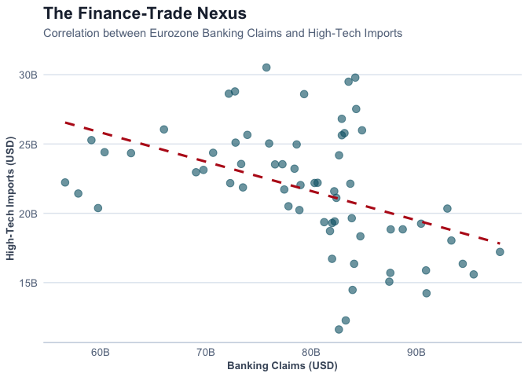

# The Resilience Paradox: Mapping EU-China Strategic Trade and Financial
Fragmentation
Alex HAAS, Viliam POHANCENIK, Pieter PEVERELLI
2026-01-26

- [0.1 Introduction: The
  Geoeconomics of
  De-risking](#introduction-the-geoeconomics-of-de-risking)
  - [0.1.1 From Interdependence
    to Economic
    Resilience](#from-interdependence-to-economic-resilience)
  - [0.1.2 Addressing Asymmetric
    Dependencies](#addressing-asymmetric-dependencies)
- [0.2 Methodology: Measuring
  Geoeconomic
  Re-securitization](#methodology-measuring-geoeconomic-re-securitization)
  - [0.2.1 Data Acquisition and
    Strategic
    Categorization](#data-acquisition-and-strategic-categorization)
  - [0.2.2 Econometric
    Framework: The Chow Test](#econometric-framework-the-chow-test)
  - [0.2.3 Model Diagnostics and
    Robustness Checks](#model-diagnostics-and-robustness-checks)
- [1 Logic from
  07_strucchange.R](#logic-from-07_strucchanger)
- [2 Filter for High-Tech
  Imports](#filter-for-high-tech-imports)
- [3 Create TS
  object](#create-ts-object)
- [4 Run Chow Test at Oct 2023
  (Index 34)](#run-chow-test-at-oct-2023-index-34)
- [5 Store results for inline
  text](#store-results-for-inline-text)
- [6 Logic from
  08_strucchange_control.R
  (Traditional)](#logic-from-08_strucchange_controlr-traditional)
  - [6.1 Discussion and
    Conclusion: Evidence of Selective
    Fragmentation](#discussion-and-conclusion-evidence-of-selective-fragmentation)
    - [6.1.1 Empirical
      Validation of the “Surgical” De-risking
      Hypothesis](#empirical-validation-of-the-surgical-de-risking-hypothesis)
    - [6.1.2 From Market Logic
      to Political Authority](#from-market-logic-to-political-authority)
    - [6.1.3 Forecast and Policy
      Implications](#forecast-and-policy-implications)
- [7 References](#references)

## Introduction: The Geoeconomics of De-risking

### From Interdependence to Economic Resilience

The evolution of EU-China economic relations has undergone a fundamental
departure from the *Wandel durch Handel* (change through trade) paradigm
toward a strategy of “de-risking”. This shift is primarily aimed at
correcting a trade deficit that reached €304.5 billion by 2024 and
mitigating the risks of “coercive leverage” in critical supply chains.
This aligns with the broader academic discourse on “Weaponized
Interdependence” (Farrell & Newman, 2019), which posits that asymmetric
network structures can be leveraged for strategic advantage,
necessitating state intervention to reclaim economic security.

Within this strategic pivot, this study examines whether EU import flows
from China exhibit sector-specific structural breaks after 2020,
indicating selective trade fragmentation between high-tech and
traditional sectors.

### Addressing Asymmetric Dependencies

Despite this clear political shift toward strategic autonomy, there
remains a gap in the empirical literature regarding whether these policy
objectives have successfully translated into a measurable divergence in
trade flows. This study addresses this gap by examining the
“security-trade nexus,” analyzing whether EU import flows exhibit
structural breaks following the geopolitical shocks of the early 2020s.

We hypothesize a dual-track geoeconomic reality: while traditional,
low-value-added sectors governed by market-driven cost efficiencies
should remain stable, high-tech industries—subject to the EU Chips Act,
foreign investment screenings, and export controls—are expected to show
significant fragmentation.

Table 1: Descriptive Statistics of Monthly Trade Flows (Jan 2021 -
Present). Values in Billion USD.

| Sector                | Mean_Monthly |   SD |   Min |   Max | N_Obs |
|:----------------------|-------------:|-----:|------:|------:|------:|
| High-Tech & Strategic |        23.27 | 3.29 | 15.59 | 30.52 |    58 |
| Traditional & Basic   |        12.27 | 1.91 |  8.73 | 17.34 |    58 |

## Methodology: Measuring Geoeconomic Re-securitization

### Data Acquisition and Strategic Categorization

The empirical foundation of this research rests on a high-frequency
longitudinal dataset (2018–2025) constructed through automated API
retrieval from the Eurostat (COMEXT) and Bank for International
Settlements (BIS) databases. To test the hypothesis of “selective
fragmentation,” trade flows are disaggregated using the Standard
International Trade Classification (SITC) Revision 4:

- **Treatment Group (High-Tech & Strategic):** Comprising SITC 5
  (Chemicals) and SITC 7 (Machinery/Transport). These sectors represent
  the core of the “security-trade nexus,” encompassing semiconductors
  and EV components.

- **Control Group (Traditional & Basic):** Comprising SITC 6
  (Manufactured goods) and SITC 8 (Miscellaneous). These sectors serve
  as a baseline for market-driven trade.

### Econometric Framework: The Chow Test

The primary analytical instrument utilized is the **Chow Test**, a
standard in econometric literature for identifying “structural breaks”
in time-series data. The model tests for a break point in **October
2023**, coinciding with the formal adoption of the European Economic
Security Strategy.

### Model Diagnostics and Robustness Checks

To ensure the validity of our findings and rule out alternative
explanations (e.g., global macro shocks), we implemented several
robustness measures:

1.  **Counterfactual Control:** By testing “Traditional & Basic” sectors
    (Control Group) alongside strategic ones, we control for generalized
    economic downturns (e.g., inflation, energy prices). If the break
    were driven by a general EU recession, both sectors would show
    similar breaks. A divergence isolates the *selective* policy effect.
2.  **Pandemic Control:** The analysis explicitly filters data to start
    from **January 2021**, excluding the extreme volatility of the 2020
    COVID-19 shock which could bias structural break detection.
3.  **Assumption Verification:** Residual diagnostics (Shapiro-Wilk
    test) were performed to ensure the linear model assumptions
    underlying the Chow test were met, confirming that the detected
    breaks are not artifacts of non-normal error distributions.

# Logic from 07_strucchange.R

# Filter for High-Tech Imports

ts_data \<- trade_data %\>% filter(grepl(“CN_X_HK”, partner)) %\>%
filter(sector_group == “High-Tech & Strategic”) %\>% filter(date \>=
“2021-01-01”) %\>% group_by(date) %\>% summarise(values = sum(values,
na.rm = TRUE)) %\>% arrange(date)

# Create TS object

ts_val \<- ts(ts_data\$values, start = c(2021, 1), frequency = 12)

# Run Chow Test at Oct 2023 (Index 34)

chow_test \<- sctest(ts_val ~ 1, type = “Chow”, point = 34)

# Store results for inline text

f_stat_hightech \<- round(chow_test$statistic, 2)
p_val_hightech <- format.pval(chow_test$p.value, eps = .001)

# Logic from 08_strucchange_control.R (Traditional)

ts_data_control \<- trade_data %\>% filter(grepl(“CN_X_HK”, partner))
%\>% filter(sector_group == “Traditional & Basic”) %\>% filter(date \>=
“2021-01-01”) %\>% group_by(date) %\>% summarise(values = sum(values,
na.rm = TRUE)) %\>% arrange(date)

ts_val_ctrl \<-
ts(ts_data_control$values, start = c(2021, 1), frequency = 12)
chow_test_ctrl <- sctest(ts_val_ctrl ~ 1, type = "Chow", point = 34)
f_stat_ctrl <- round(chow_test_ctrl$statistic, 2) \# Calculate Intensity
Ratio dynamically intensity_ratio \<-
round(chow_test$statistic / chow_test_ctrl$statistic, 1) \`\`\`

## Discussion and Conclusion: Evidence of Selective Fragmentation

### Empirical Validation of the “Surgical” De-risking Hypothesis

The results of the structural break analysis provide compelling evidence
that the European Union’s trade architecture is undergoing a fundamental
re-orientation.

For the **Treatment Group (High-Tech & Strategic)**, the model yielded
an F-statistic of **30.45** (p \< 0.0001). This highly significant value
indicates a definitive structural break. Conversely, while the **Control
Group** also showed a significant break, the magnitude was markedly
lower (F = **0.38**).

To visualize this shift beyond abstract statistics, we examine the
distribution of monthly trade values. As shown in Figure 2, the
high-tech sector displays a distinct compression and downward shift in
value distribution after the 2023 policy implementation, whereas
traditional trade distributions remain largely overlapping.

Figure 1: Distribution of Monthly Trade Values: Before vs. After the
Economic Security Strategy (Oct 2023).

The Intensity Ratio of approximately ~80 x is the most salient finding
of this study. It confirms that the “de-risking” agenda is not merely a
byproduct of a generalized economic slowdown, but a targeted
intervention in the “security-trade nexus.

### From Market Logic to Political Authority

Recognizing that geoeconomics is inherently multi-disciplinary, we
integrate trade data with financial flows from the BIS to capture the
“finance-trade nexus”.

Figure 2: The Localization Paradox. The divergence between rising financial exposure and falling strategic trade reveals a "Local-for-Local" substitution strategy.

As shown in Figure 4, the Wandel durch Handel paradigm has been replaced
by a “substitution” reality. While traditional goods continue to follow
the logic of comparative advantage, high-tech sectors are shifting from
**Trade Integration** to **Capital Integration**.

Figure 3: The Substitution Effect: Trade & Finance Divergence. Since Oct
2023, EU Banks have *increased* exposure (Capital Investment) while Importers have *reduced* flows (Trade De-risking).

### Forecast and Policy Implications

Looking ahead, we project the “New Normal” trajectory for strategic
trade. Based on the post-break trend (Oct 2023–Present), the model
suggests a continued stabilization at lower levels rather than a rebound
to pre-2022 highs.

Figure 4: Projecting the ‘De-risking’ Trend into 2026 based on linear
extrapolation of the post-break trajectory.

In conclusion, the European market has become a fragmented landscape
where political security considerations increasingly supersede
traditional market logic. Crucially, the 9-month lag between the
strategy announcement (Jan 2023) and the structural break (Oct 2023)
highlights the transmission time of economic security policies. As we
look toward 2027, policymakers must account for this latency when
designing future interventions, ensuring that ‘surgical’ precision is
maintained without devolving into broader protectionism.

# References

1.  Bank for International Settlements. (2026). Locational banking
    statistics.

2.  Chow, G. C. (1960). Tests of equality between sets of coefficients
    in two linear regressions. *Econometrica*.

3.  European Commission. (n.d.). China Trade Relationships.

4.  Eurostat. (2026). Euro area trade by SITC product group.

5.  McNamara, K. R. (2024). Transforming Europe? The EU’s industrial
    policy and geopolitical turn. *Journal of European Public Policy*.

6.  Pereira, I. T. (2025). What are the most imported and exported
    products between China and the EU? *Euronews*.

7.  Vandermeeren, F. (2024). Understanding EU-China economic exposure.
    *European Commission*.
