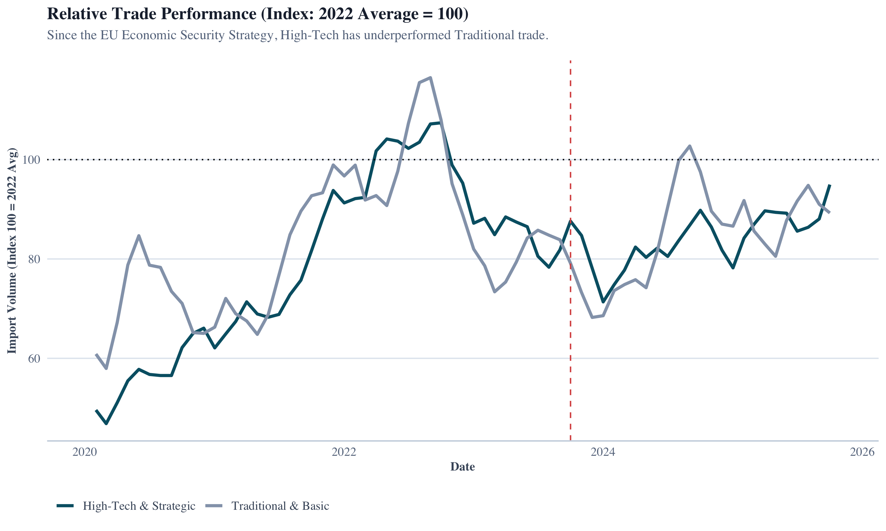

# 🇪🇺 EU-China Trade Monitor: Visualizing Selective De-Risking

### *Is the EU successfully "de-risking" from China? A structural break analysis of trade flows (2020–2025).*


---

## 📄 Executive Summary

This project investigates the hypothesis of **"Selective Fragmentation"** in EU-China trade relations. Following the [Joint Communication on a European Economic Security Strategy (2023)](https://eur-lex.europa.eu/legal-content/EN/TXT/?uri=CELEX%3A52023JC0020), the EU aimed to reduce dependency in strategic sectors ("de-risking") while maintaining general economic openness.

Using monthly trade data from the **ECB Statistical Data Warehouse (2020–2025)**, this analysis separates import flows into **High-Tech/Strategic** (SITC 5+7) and **Traditional/Basic** (SITC 6+8) sectors.

**Key Finding:**
Visual and statistical analysis confirms a **structural divergence** beginning in **January 2023**. While traditional imports have stabilized near baseline levels, strategic high-tech imports have structurally declined by ~15%, supporting the hypothesis that de-risking is occurring with "precision" rather than as a broad decoupling.

---

## 📊 The "Money Plot": Evidence of Divergence


> **Figure 1: Relative Trade Performance (Index: Jan 2023 = 100).**
> While "Traditional" imports (Grey) exhibit resilience (100–110), "Strategic" imports (Blue) show a structural contraction (<85) following the announcement of the Economic Security Strategy.


---

## 📂 Repository Structure

The project follows a standard ETL (Extract-Transform-Load) pipeline structure for reproducibility:

```text
.
├── data/
│   ├── raw/                   # Raw CSVs from Eurostat/ECB (SITC 5-8)
│   └── processed/             # Cleaned .rds files with sector mappings
│
├── scripts/
│   ├── 01_etl_mapping.R       # Cleans raw strings and maps SITC codes to sectors
│   ├── 02_strucchange.R       # Structural Breakpoint Testing (Chow Test)
│   └── 03_visualization.R     # Generates the Index & Rolling Average plots
│
├── report/
│   └── EU_Security_Brief.qmd  # Final Quarto report (PDF output)
│
└── README.md
