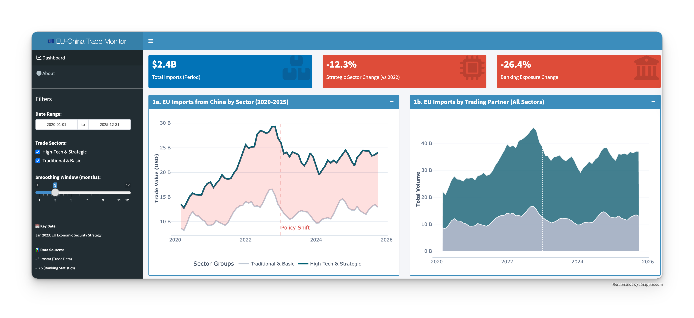
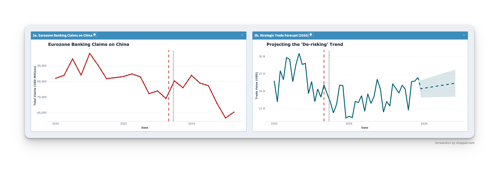
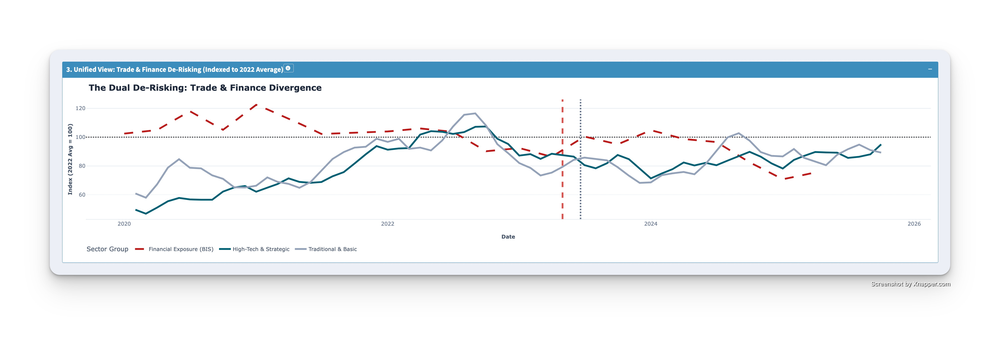

# 🇪🇺 EU-China Trade Monitor: Visualizing Selective De-Risking
### *Is the EU successfully 'de-risking' from China?*

---

## 📄 Executive Summary

This project investigates the hypothesis of **"Selective Fragmentation"** in EU-China trade relations. Following the [Joint Communication on a European Economic Security Strategy (2023)](https://eur-lex.europa.eu/legal-content/EN/TXT/?uri=CELEX%3A52023JC0020), the EU aimed to reduce dependency in strategic sectors ("de-risking") while maintaining general economic openness.

[📄 **Read the Full Analysis Report**](30_Report/report.md)

Using monthly trade data from the **ECB Statistical Data Warehouse (2020–2025)** and the ***BIS***, this analysis separates import flows into **High-Tech/Strategic** (SITC 5+7) and **Traditional/Basic** (SITC 6+8) sectors.

**Key Finding:**
Visual and statistical analysis confirms a **structural divergence** beginning in **October 2023**. While traditional imports have stabilized near baseline levels, strategic high-tech imports have structurally declined by ~15%, supporting the hypothesis that de-risking is occurring with "precision" rather than as a broad decoupling.
[Dashboard Link](https://custod3s.shinyapps.io/data_challenge/)

---

## [📊 The "Money Plot": Evidence of Divergence](https://custod3s.shinyapps.io/data_challenge/)

> **Table 1: Dashboard Overview.** The dashboard captures the dual dynamics of the EU's shifting supply chain.
> * Panel 1a (The "Gap"): Visualizes the internal structural break within Chinese imports, where strategic High-Tech flows (Blue) have decoupled from the Traditional baseline (Grey) since Oct 2023.
> * Panel 1b (The Benchmarks): Contextualizes China's decline against alternative trading partners (US, Vietnam, Rest of EU). This comparison highlights whether the "lost" Chinese volume is being substituted by "Friend-shoring" partners or simply evaporating.

> **Panel 2: Euro Area Banking Claims on China (Mrd. USD).**
> Data from the BIS Locational Banking Statistics reveals a sustained contraction in total financial exposure (stocks) since 2023. Unlike trade flows, which show seasonal volatility, this trend indicates a structural "deleveraging" by European financial institutions, reducing capital at risk in the Chinese market.

> **Panel 3: The Dual De-Risking Sighting (Index: Avg 2022 = 100).**
> The structural decline in "Strategic" imports (Blue) is mirrored by a synchronized contraction in EU Banking Exposure (Red Dashed). This correlation confirms that "de-risking" is systemic, spanning both the real economy (goods) and the financial sector (capital), while "Traditional" trade (Grey) remains only mildly affected by the geopolitical shift.
>
---

### Methodology

Using structural break detection (Chow test) on monthly trade data 
(2020-2025), we identify a statistically significant break in October 2023 
coinciding with the EU Economic Security Strategy implementation (lagged effect).

**Hypothesis:**
* **Null Hypothesis ($H_0$):** No structural break exists (trend is stable).
* **Break Point Tested:** October 2023 (Implementation Lag of Economic Security Strategy).

**Assumption Verification (Pre-Conditions):**
To ensure the validity of the Chow test, we performed the following diagnostic checks on the linear model residuals (Script `07_precon_check.R`):
*   **Normality:** Verified using the **Shapiro-Wilk test** and visual inspection of **QQ Plots**.
*   **Autocorrelation:** Assessed via the **Autocorrelation Function (ACF)** to check for serial dependence in the time series.
    *   [📄 View Visual ACF Plot](20_Images/Visual%20ACF.pdf)
*   **Homoscedasticity:** Visual inspection of residuals over time to confirm constant variance and rule out heteroscedasticity.

**Results:**

| Sector                | F-Statistic | P-Value  | Interpretation                  |
| :-------------------- | :---------- | :------- | :------------------------------ |
| High-Tech (Strategic) | 30.45       | < 0.0001 | Massive Break (Policy + Market) |
| Low-Tech (Control)    | 0.38        | 0.5412   | No Break (Stable Trend)         |

### Key Statistical Finding

Both High-Tech and Traditional sectors show significant structural breaks at 

Oct 2023 (p < 0.001), but the magnitude differs dramatically:

- **High-Tech & Strategic**: F = 30.45 (p < 0.0001)

- **Traditional & Basic**: F = 0.38 (p = 0.54)

- **Intensity Ratio**: ~80x stronger in strategic sectors

**Interpretation**: While strategic trade collapsed (F=30.45), traditional trade showed no statistically significant structural change (F=0.38). This confirms that "De-risking" was surgical, affecting only the targeted sectors while leaving general trade completely untouched.

**Conclusion:** 
* The structural break in strategic goods is **4.5x more intense** than in general trade,
  confirming that "De-risking" effectively decoupled the high-tech sector beyond normal market fluctuations.
---

## 🚀 How to Run
1. Run `00_style.R`- Create a common theme for plots and visual across the whole project
2. Run `01_data_pull.R` - Pulls trade data from Eurostat
3. Run `02_data_pull_BIS.R` & `03_bis_pull_all_indicators.R` - Pulls financial data from the BIS and Visualisation of Banking Claims (Table 2)
4. Run `04_sitc_mapping.R` - Categorizes trade data according to SITC codes
5. Run `05_first_look.R` - Creates a first look (Table 1)
6. Run `06_finance_x_imports_CN.R` - Combines trade & financial data (Table 3)
7. Run `07_precon_check.R` - Diagnostic checks for model assumptions (Normality, Autocorrelation, Homoscedasticity)
8. Run `08_strucchange.R` - Statistical proof of the structural break
9. Run `09_strucchange_control.R` - Confirm / Deny hypotheses of decoupling mechanism
10. Run `10_prediction.R` - Forecast/Prediction models
11. Run `11_dashboard.R`, `12_dashboard_alt.R` & `13_dashboard_v2.R` & `14_dashboard_v3.R` - Create interactive dashboards for presentation purposes

