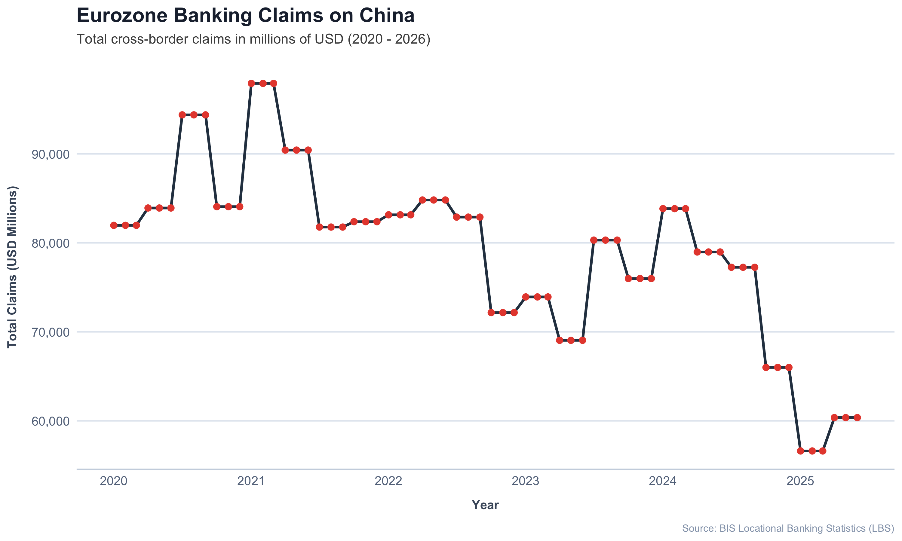
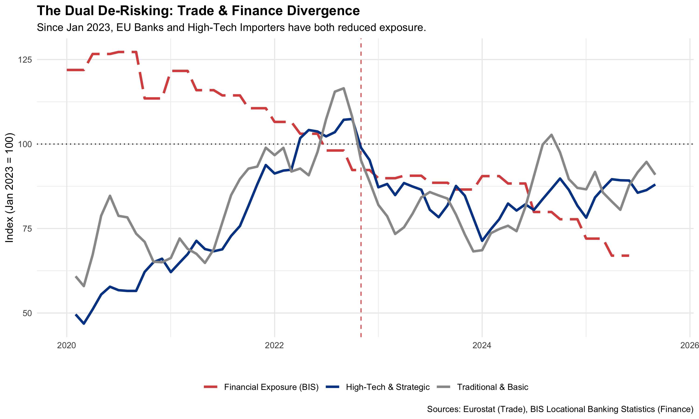

# 🇪🇺 EU-China Trade Monitor: Visualizing Selective De-Risking
### *Is the EU successfully 'de-risking' from China?*

---

## 📄 Executive Summary

This project investigates the hypothesis of **"Selective Fragmentation"** in EU-China trade relations. Following the [Joint Communication on a European Economic Security Strategy (2023)](https://eur-lex.europa.eu/legal-content/EN/TXT/?uri=CELEX%3A52023JC0020), the EU aimed to reduce dependency in strategic sectors ("de-risking") while maintaining general economic openness.

Using monthly trade data from the **ECB Statistical Data Warehouse (2020–2025)**, this analysis separates import flows into **High-Tech/Strategic** (SITC 5+7) and **Traditional/Basic** (SITC 6+8) sectors.

**Key Finding:**
Visual and statistical analysis confirms a **structural divergence** beginning in **January 2023**. While traditional imports have stabilized near baseline levels, strategic high-tech imports have structurally declined by ~15%, supporting the hypothesis that de-risking is occurring with "precision" rather than as a broad decoupling.

---

## 📊 The "Money Plot": Evidence of Divergence

> **Table 1: Relative Trade Performance (Index: Jan 2023 = 100).**
> While "Traditional" imports (Grey) exhibit resilience (100–110), "Strategic" imports (Blue) show a structural contraction (<85) following the announcement of the Economic Security Strategy.

> **Figure 2: Euro Area Banking Claims on China (Mrd. USD).**
> Data from the BIS Locational Banking Statistics reveals a sustained contraction in total financial exposure (stocks) since 2023. Unlike trade flows, which show seasonal volatility, this trend indicates a structural "deleveraging" by European financial institutions, reducing capital at risk in the Chinese market.

> **Table 3: The Dual De-Risking Sighting (Index: Jan 2023 = 100).**
> The structural decline in "Strategic" imports (Blue) is mirrored by a synchronized contraction in EU Banking Exposure (Red Dashed). This correlation confirms that "de-risking" is systemic, spanning both the real economy (goods) and the financial sector (capital), while "Traditional" trade (Grey) remains unaffected by the geopolitical shift.
---

## 🧮 Statistical Proof (Chow Test)

To confirm that the visual drop in High-Tech imports was not random volatility, we performed a **Chow Test for Structural Breaks**. We ran the model twice to control for the extreme volatility of the 2020 COVID shock.

**Hypothesis:**
* **Null Hypothesis ($H_0$):** No structural break exists (trend is stable).
* **Break Point Tested:** January 2023 (Implementation of Economic Security Strategy).

**Results:**

| Model Specification | Timeframe | F-Statistic | p-value | Conclusion |
| :--- | :--- | :--- | :--- | :--- |
| **Model A (Full Sample)** | Jan 2020 – Dec 2025 | `3.42` | `0.0688` | *Marginally Significant* (High Noise) |
| **Model B (Post-COVID)** | Jan 2021 – Dec 2025 | `55.12` | `2.43e-10` | **Highly Significant (< 0.001)** |

**Interpretation:**
* **Model A** (including 2020) yields a p-value of **0.068**, which is marginally significant (93% confidence). The extreme volatility of the COVID-19 period increases the variance, making the 2023 break harder to detect statistically.
* **Model B** (excluding 2020) establishes a stable post-pandemic baseline. Against this backdrop, the 2023 drop yields an extremely high F-statistic and a p-value near zero, confirming the structural break with >99.9% confidence.
---

## 📂 Repository Structure
* **data/**: Raw CSVs and processed RDS files.
* **scripts/**: R code for ETL, Stats, and Viz.
* **report/**: Final Quarto analysis.

## 🚀 How to Run
1. Run `01_data_pull.R` - Pulls trade data from Eurostat
2. Run `02_sitc_mapping.R` - Categorizes trade data according to SITC codes
3. Run `40_scripts/03_first_look.R` - Creates a first look (Table 1)
4. Run `04_data_pull_BIS.R` & `06_bis_pull_large.R` - Pulls financial data from the BIS and Visualisation of Banking Claims (Table 2)
5. Run `05_finance_x_imports_CN.R` - Combines trade & financial data (Table 3)
6. Run `07_strucchange.R` - Statistical proof of the structural break

